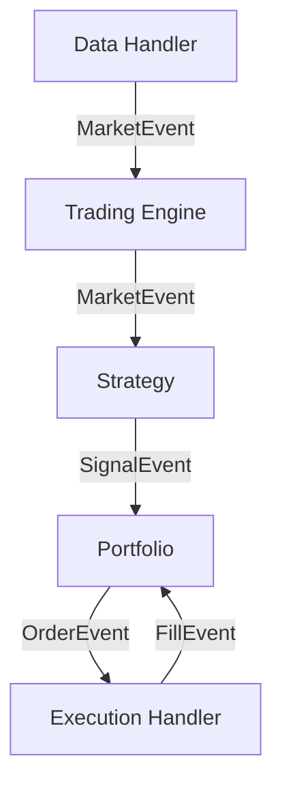

[Korean Version (한국어 가이드)](README_KR.md)

# LuminaQuant Documentation

**LuminaQuant** is an advanced, event-driven quantitative trading system designed for professional-grade backtesting and live trading. It features a modular architecture that supports multiple exchanges, robust state management, and sophisticated strategy optimization.

## Repository Role (Source of Truth)

- **Private source-of-truth repo** (maintainers/internal): `https://github.com/hoky1227/Quants-agent.git`
- **Public distribution repo** (external/read-only subset): `https://github.com/HokyoungJung/LuminaQuant.git`
- Python package/import namespace: `lumina_quant` (distribution name: `lumina-quant`)

---

## 📚 Documentation Index

| Section | Description |
| :--- | :--- |
| **[Installation & Setup](#installation)** | Getting started with LuminaQuant. |
| **[Deployment Guide](docs/DEPLOYMENT.md)** | Deployment notes and operational checklist. |
| **[Live Readiness Runbook](docs/live-readiness/04-paper-trading-runbook.md)** | Paper/testnet-only live handoff, protective-order contract, and real-money blockers. |
| **[Migration Guide](docs/MIGRATION_GUIDE_POSTGRES_PARQUET.md)** | Local-only migration to Parquet + PostgreSQL. |
| **[GPU Auto Notes](docs/DESIGN_NOTES_GPU_AUTO.md)** | Polars GPU/CPU auto-selection and fallback design. |
| **[Rust Native Acceleration](docs/RUST_NATIVE_ACCELERATION.md)** | Hotspot-only Rust migration policy, build commands, and benchmark evidence. |
| **[Optimization Refactor Notes](docs/OPTIMIZATION_REFACTOR_NOTES.md)** | Shared Optuna/search policy, bounded-grid exceptions, and cleanup rules. |
| **[Validation Report](docs/VALIDATION_REPORT.md)** | Verification + optimization report for core workflows. |
| **[Final Validation Guide](docs/FINAL_VALIDATION.md)** | Real-data-only final validation vs continuity validation and raw-first lineage policy. |
| **[Futures Strategy Factory](docs/FUTURES_STRATEGY_FACTORY.md)** | Candidate generation, weighted shortlist, and portfolio-set policy. |
| **[Scoring Config Guide](docs/SCORING_CONFIG_GUIDE.md)** | Shared score-config template usage across research/shortlist/optimization scripts. |
| **[Workflow Guide](docs/WORKFLOW.md)** | Private/Public branch operation and publish checklist. |
| **[Local Artifact Cleanup](docs/LOCAL_ARTIFACT_CLEANUP.md)** | Safe cache/log/build cleanup while preserving research notes, results, and data. |
| **[8GB Baseline Quickstart](docs/QUICKSTART_8GB_BASELINE.md)** | Minimal install/smoke/replay/shadow-live/dashboard/safe-stop/cleanup flow. |
| **[Exchange Guide](docs/EXCHANGES.md)** | Detailed setup for **Binance USDⓈ-M Futures**, **MetaTrader 5**, and **Polymarket**. |
| **[External Data Guide](docs/EXTERNAL_DATA.md)** | Canonical contracts for user-managed backtest/live data. |
| **[Minimal Installs](docs/MINIMAL_INSTALLS.md)** | Persona-oriented extras for backtest-only / live-only installs. |
| **[Trading Manual](docs/TRADING_MANUAL.md)** | **How-To**: Buy/Sell, Leverage, TP/SL, Trailing Stops. |
| **[Performance Metrics](docs/METRICS.md)** | Explanation of Sharpe, Sortino, Alpha, Beta, etc. |
| **[Developer API](docs/API.md)** | How to write Strategies and extend the system. |
| **[Contributing](CONTRIBUTING.md)** | Local checks, CI parity commands, and PR expectations. |
| **[Security](SECURITY.md)** | Vulnerability reporting and credential handling policy. |
| **[Configuration](#configuration)** | Quick reference for `config.yaml`. |

## 🏗 Architecture

LuminaQuant follows a modular **Event-Driven Architecture**:



- **DataHandler**: Manages historical (CSV) or live (WebSocket) data feeds.
- **Strategy**: Generates `SignalEvent` based on market data (e.g., RSI < 30).
- **Portfolio**: Manages state, positions, and risk. Converts Signals to `OrderEvent`.
- **ExecutionHandler**: Simulates fills (Backtest) or executes usage API (Live).

Current local-first stack defaults:
- **1s market store**: Parquet (ZSTD, exchange/symbol/date partitioning)
- **State/audit/job control**: PostgreSQL (local)
- **Backtest/optimization compute**: Polars Lazy with GPU-first execution (`gpu` by default; CI/non-GPU environments can override to `cpu` or `auto`)
- **Native/fast-path acceleration**: Python APIs stay stable; proven hot kernels use Rust underneath when built. Raw-first aggTrades→1s OHLCV, the Alpha Zoo Optuna hybrid portfolio loop, and Alpha Zoo live state-signal machines auto-load Rust backends when available; live `MARKET_WINDOW` construction uses a trusted Python fast path where Rust would still pay Python tuple conversion costs; metrics evaluation still auto-selects Numba/Python because local Rust metrics is not faster yet.

## Current Private Paper/Testnet Status (2026-05-30)

The current private Alpha Zoo live handoff is **paper/testnet-only**. It is not a real-money approval.

- Selected runtime: `AlphaZooOptunaHybridLiveStrategy` for the frozen Optuna v3.5 hybrid artifact.
- Standard live refits now use refreshed committed data, the latest 8 complete weeks as validation,
  Optuna tuning for every exposed hybrid parameter, and a final refit on train+validation before
  freezing the runtime artifact. Live final-refit mode intentionally has no locked-OOS/test set.
- Latest standard-refit evidence is under
  `var/reports/profit_moonshot_20260501/current_tail_20260508/alpha_v2/alpha_zoo_standard_live_refit_20260528/`;
  data coverage for the watch universe reaches `2026-05-28T10:59:59Z`.
- Broad challenger evidence now exists for the full 69-symbol Binance research universe. The first
  broad blend lives under
  `var/reports/profit_moonshot_20260501/current_tail_20260508/alpha_v2/alpha_zoo_69_asset_optuna_hybrid_refit_20260530/`
  and is a low-MDD diversified shadow candidate. The corrected per-profile expansion lives under
  `var/reports/profit_moonshot_20260501/current_tail_20260508/alpha_v2/alpha_zoo_69_asset_profile_optuna_hybrid_refit_20260530/`: it treats
  balanced/growth/aggressive as risk templates expanded across all 69 assets, Optuna-tunes each
  symbol/profile pair, applies BTC/ETH/SOL/SPY/QQQ/XAU/XAG/crude domain-anchor concentration filters,
  and selects a train/validation-legal paper candidate with train `+160.3316%`, validation `+150.0726%`,
  validation MDD `7.5634%`, and train/validation RPT proxy `69.40/152.18bps`. It is not a real-money
  approval and still needs a live/paper adapter plus forward fill/BBO/slippage/protection/reconciliation telemetry.
- Live implementation is split into reproducibility-safe modules: frozen artifact/config loading in
  `lumina_quant.alpha_zoo.optuna_hybrid_config`, signal/bar math in
  `lumina_quant.alpha_zoo.optuna_hybrid_signals` with optional Rust state-machine acceleration, and orchestration/event emission in
  `lumina_quant.alpha_zoo.optuna_hybrid_live_strategy`.
- Regression tests freeze the selected artifact metrics, live limit-first decision contract, and
  reconstructed sleeve/weight config before further refactors.
- The live rolling `MARKET_WINDOW` path now skips duplicate row normalization only for internal canonical producers (`RollingWindowAggregator` and committed materialized snapshots); external payloads still go through full schema normalization.
- Safety flags remain hard-false in the latest handoff artifact: `ready_for_real=false`, `real_money_execution=false`, `real_execution_allowed=false`.
- Live order generation is limit-first by default: entry, short-entry, reduce-only exit, and risk-flatten orders use `LMT`; market orders require explicit `live.default_order_type: "MKT"` plus `live.allow_market_orders: true`.
- Default limit pricing is `one_tick_worse` for fast bounded execution: BUY one tick above the reference, SELL one tick below it; `same_price` and `one_tick_better` remain config options.
- Paper/testnet protection now covers both local intrabar component exits and exchange-side Binance USDⓈ-M conditional algo limit protection after an entry fill: `STOP` / `TAKE_PROFIT` through `POST /fapi/v1/algoOrder`.
- The Binance algo request path is allowlisted to documented exchange fields; internal parent/protection telemetry stays local for reconciliation.
- Asset applicability is regression-tested across the selected frozen source assets `ETHUSDT`, `SOLUSDT`, and `TRXUSDT`; broader assets still need the same paper/testnet evidence before promotion.
- Real-money remains blocked until actual paper/testnet fill, BBO spread, slippage, reject/timeout, reconciliation, and protective-order telemetry prove the 10bps/replay-live parity assumptions.

See `docs/live-readiness/04-paper-trading-runbook.md` and `docs/research_note/research_note.md` for the current operator handoff.

Research notes are intentionally kept under `docs/` rather than local caches: the canonical research-note directory is `docs/research_note/` (`research_note.md` for the current note and `research_history.md` for the global ledger), session checkpoints live in `.omx/notepad.md`, and large generated evidence remains under `var/reports/`. See `docs/LOCAL_ARTIFACT_CLEANUP.md` before deleting local artifacts.

---

## ⚙️ Setup & Configuration

### Prerequisites
- Python 3.11 to 3.13
- [uv](https://docs.astral.sh/uv/) for dependency/runtime management
- [Polars](https://pola.rs/) pinned to `polars>=1.35.2,<1.36` and GPU extra pinned to `cudf-polars-cu12>=26.2,<26.3` (validated RAPIDS line for current CI/runtime contract); keep pandas on the validated 2.x line (`pandas>=2.2.0,<3`) until a separate pandas-3 compatibility pass proves parity
- [Talib](https://github.com/TA-Lib/ta-lib-python) (for technical indicators)

### Environment Variables
For security, **never commit API keys**. Create a `.env` file in the root directory:

```ini
# .env file
BINANCE_API_KEY=your_api_key
BINANCE_SECRET_KEY=your_secret_key
LQ_POSTGRES_DSN=postgresql://localhost:5432/luminaquant
LQ_GPU_MODE=gpu
LQ_GPU_DEVICE=0
LOG_LEVEL=INFO
```

*See `.env.example` for a template.*

---

## 🚀 Quick Start

### 1. Installation

```bash
# Clone the private source-of-truth repo (recommended for maintainers)
git clone https://github.com/hoky1227/Quants-agent.git
cd Quants-agent

# Public mirror alternative (external users/read-only workflow)
# git clone https://github.com/HokyoungJung/LuminaQuant.git
# cd LuminaQuant

# Ensure compatible Python (project requires < 3.14)
uv python pin 3.13

# Example full local maintainer install
uv sync --extra backtest --extra optimize --extra live-binance --extra live-mt5 --extra live-polymarket --extra dashboard --extra dev

# Dashboard frontend (Next.js) also needs Node 20+ dependencies once
cd apps/dashboard_web && npm install && cd ../..

# (Optional) GPU runtime on Linux x86_64 + CUDA 12
uv sync --extra gpu

# Verify install and tests
uv run python scripts/verify_install.py

# Example minimal profiles
uv sync --extra backtest --extra dev
uv sync --extra live-binance --extra dev
uv sync --extra live-mt5 --extra dev
uv sync --extra live-polymarket --extra dev
```

### 1-Minute Minimum Viable Run (No DB, No API Keys)

```bash
uv run python scripts/minimum_viable_run.py
```

This command generates tiny synthetic CSV data (if missing), forces a local CSV-only backtest profile, and runs a smoke backtest without requiring PostgreSQL or exchange credentials.

### 2. Configuration

LuminaQuant uses `config.yaml` for all settings.

**Generic Setup:**
```yaml
trading:
  symbols: ["BTC/USDT", "ETH/USDT"]
  timeframe: "1h"
  initial_capital: 10000.0
```

**Choose Your Exchange:**

*   **Binance USDⓈ-M Futures**: Set `driver: "binance_futures"`
*   **MetaTrader 5 (Forex/Stocks)**: Set `driver: "mt5"`

*👉 See [Exchange Guide](docs/EXCHANGES.md), [External Data Guide](docs/EXTERNAL_DATA.md), and [Minimal Installs](docs/MINIMAL_INSTALLS.md) for provider setup, custom data formats, and minimal dependency profiles.*

### Public vs Private Repository Scope

- This public repository intentionally excludes proprietary research IP:
  - `src/lumina_quant/indicators/`
  - `strategies/`
  - private strategy/indicator test files
- This public repository also excludes DB construction/sync code:
  - `src/lumina_quant/data_sync.py`
  - `src/lumina_quant/data_collector.py`
  - `scripts/sync_binance_ohlcv.py`
  - `scripts/collect_market_data.py`
  - `tests/test_data_sync.py`
- This public repository also excludes private research/deployment metadata surfaces:
  - tuned candidate libraries / research runners / article-pipeline workflows
  - exact-window evaluation/reporting/dashboard surfaces and deployment scenario generators
  - follow-up watchlist logic and research candidate/optimization orchestration
  - strategy-specific test fixtures that reveal tuned constants, family IDs, or shortlist metadata
- Full strategy/indicator implementation and AGENTS guidance are maintained in the private repository.
- Database/runtime artifacts are never published (`data/`, `logs/`, `.omx/`, `.sisyphus/`).
- Valid report artifacts may exist in the private repo for operations/review, but are never pushed to the public repo.

### 3. Running the System

**(Private repo only) Sync Binance OHLCV into local Parquet market storage (and CSV mirror):**
```bash
uv run python scripts/sync_binance_ohlcv.py \
  --symbols BTC/USDT ETH/USDT \
  --timeframe 1m \
  --db-path data/market_parquet \
  --force-full
```

In the public repository, sync/build helpers are intentionally removed. Use prebuilt market parquet files or CSV data.

Extended Binance research universe (private repo): `src/lumina_quant/research_universe.py` now records the current side-effect-free snapshot of 10 core crypto + 59 Binance USD-M `TRADIFI_PERPETUAL` symbols. Direct 1m research bars for all 69 symbols are stored under `data/market_parquet/exchange=binance` and are used by the OOM-capped 69-asset Optuna refit runner. Use `BINANCE_EXTENDED_RESEARCH_SYMBOLS_SLASHED` for future staged refresh/coverage inventory jobs; adding or collecting research bars for the symbols does not approve real-money trading. See `docs/RUNBOOK_1Y_1S_LOCAL.md` and `docs/research_note/research_note.md`.

**Raw aggTrades → committed materialized pipeline (private repo):**
```bash
# 0) First bootstrap run (recommended): set explicit --since once.
uv run python scripts/collect_binance_aggtrades_raw.py \
  --symbols BTC/USDT,ETH/USDT \
  --db-path data/market_parquet \
  --since 2026-03-01T00:00:00Z \
  --no-periodic

# 1) Raw collector (checkpoint-resumable periodic loop)
uv run python scripts/collect_binance_aggtrades_raw.py \
  --symbols BTC/USDT,ETH/USDT \
  --db-path data/market_parquet \
  --periodic --poll-seconds 2 --cycles 2

# 2) Materializer (raw -> committed 1s + required trading.timeframes bundle)
uv run python scripts/materialize_market_windows.py \
  --symbols BTC/USDT,ETH/USDT \
  --timeframes 1s,1m,5m,15m,30m,1h,4h,1d \
  --db-path data/market_parquet \
  --periodic --poll-seconds 5 --cycles 2

# 3) Live trader (default = committed source; optional Binance live source via config flags)
uv run lq live
```

Collector bootstrap behavior:
- If `--since` is empty and no raw checkpoint exists yet, collector starts from
  `now - storage.collector_bootstrap_lookback_hours` (default: 24h).
- For deterministic initial coverage, prefer explicit `--since` on first run.

Materializer window behavior:
- If `--start-date/--end-date` are omitted, periodic materializer runs reuse the
  latest committed `1s` manifest and re-read only the UTC date partitions that can
  still change (for the default timeframe set, this is typically "current UTC day
  so far"; the replay span depends on the largest required timeframe plus any
  day-boundary gap since the last committed anchor).
- Use `--full-rebuild` to force the previous full-history scan behavior when you
  intentionally want a historical rebuild, or when raw backfills/repairs land
  earlier than the latest committed materializer anchor.

Pre-live committed data check:
```bash
uv run python - <<'PY'
from lumina_quant.storage.parquet import ParquetMarketDataRepository
repo = ParquetMarketDataRepository("data/market_parquet")
for symbol in ("BTC/USDT", "ETH/USDT"):
    frame = repo.load_committed_ohlcv_chunked(exchange="binance", symbol=symbol, timeframe="1s")
    print(symbol, frame.height, frame["datetime"].max())
PY
```

Rollout gate metrics (baseline/canary):
```bash
uv run python scripts/ci/export_market_window_gate_metrics.py \
  --input logs/live/market_window_metrics.ndjson \
  --output reports/live_rollout/baseline_gate_metrics.json \
  --window-hours 24 --require-flag false

uv run python scripts/ci/export_market_window_gate_metrics.py \
  --input logs/live/market_window_metrics.ndjson \
  --output reports/live_rollout/canary_gate_metrics.json \
  --window-hours 24 --require-flag true

uv run python scripts/ci/check_market_window_rollout_gates.py \
  --baseline reports/live_rollout/baseline_gate_metrics.json \
  --canary reports/live_rollout/canary_gate_metrics.json \
  --max-p95-payload-bytes 131072 \
  --max-queue-lag-increase-pct 5 \
  --max-fail-fast-incidents 0
```

**Backtest a Strategy:**
```bash
uv run lq backtest --data-mode raw-first

# Force DB-only data source
uv run lq backtest \
  --data-mode raw-first \
  --data-source db \
  --backtest-mode windowed \
  --market-db-path data/market_parquet
```

If `LQ_POSTGRES_DSN` is unset, backtest still runs but skips PostgreSQL audit persistence.

**Walk-Forward Optimization (multi-fold):**
```bash
uv run lq optimize --data-mode raw-first

# Prefer DB data, fallback to CSV in auto mode
uv run lq optimize \
  --data-mode raw-first \
  --data-source auto \
  --market-db-path data/market_parquet
```

**Preferred unified CLI (`lq`):**
```bash
uv run lq backtest --data-mode raw-first
uv run lq optimize --data-mode raw-first
uv run lq live --transport poll
uv run lq live --transport ws
uv run lq dashboard --run
uv run lq dashboard --print-contract
```

**Simple local start/stop wrappers (Linux/macOS shell):**
```bash
# one controlled paper session (env load + optional refresh/validate/preflight)
bash scripts/ops/start_live_session.sh --dsn 'postgresql:///luminaquant'

# resilient paper runner (restarts after runtime crashes, but not after graceful stop)
bash run_bot.sh --dsn 'postgresql:///luminaquant'

# graceful paper stop
bash scripts/ops/stop_live_session.sh

# install simple shell helpers into ~/.bashrc
bash scripts/ops/install_shell_aliases.sh
source ~/.bashrc

# then use:
lq-paper-on
lq-paper-off
lq-real-on
lq-real-off
```

Live migration flags (non-HFT incremental rollout):
```yaml
live:
  market_data_source: committed      # committed | binance_futures
  order_state_source: polling        # polling | user_stream
  shadow_live_enabled: false
  reconciliation_poll_fallback_enabled: true
  book_ticker_enabled: false
```

Root compatibility shims were removed. Use `uv run lq ...` as the single supported entrypoint.

### Optional private extension package

Public/main and private/main can share the same repository layout.
Proprietary strategy/indicator implementations can be distributed separately as an extension package:

- package/module: `lumina_quant_private`
- optional strategy registry module: `lumina_quant_private.strategy_registry`
- optional indicator module: `lumina_quant_private.indicators`

When installed, `lumina_quant.strategies.registry` and `lumina_quant.indicators` auto-merge private exports at runtime.


### Windowed model parity + memory safety defaults

- `lq optimize` in parquet mode uses the same **windowed MarketWindow model** as live:
  - `HistoricParquetWindowedDataHandler`
  - `backtest_mode=windowed`
  - `backtest_poll_seconds` / `backtest_window_seconds` from config/env
- Parquet optimization enforces `MAX_WORKERS=1` for RAM safety.
- `lq backtest` auto-enables low-memory profile for ranges **>= 30 days** (or `LQ_BACKTEST_LOW_MEMORY=1`):
  - `record_history=False`
  - `record_trades=False`
  - `persist_output=False`
  - `track_metrics=True`
- WAL growth guard is enabled:
  - `storage.wal_max_bytes`
  - `storage.wal_compact_on_threshold`
  - `storage.wal_compaction_interval_seconds`
  - canonical compaction script: `scripts/compact_wal_to_monthly_parquet.py`

### Optimization search policy

- Shared search-loop mechanics live in `lumina_quant.optimization.search_policy`.
- Use Optuna for tunable/high-dimensional optimization; do not open-code new
  `optuna.create_study(...)` loops in research scripts when the shared
  `run_optuna_study(...)` helper can express the same workflow.
- Direct cartesian grid enumeration is limited to small deterministic policy
  enumerations and must go through `build_bounded_grid_combinations(...)` with
  a justification/cap so artifacts explain why grid search was acceptable.
- Strategy search spaces should remain sourced from `lumina_quant.tuning.param_registry`
  or strategy registry defaults rather than duplicated ad-hoc parameter domains.

**Architecture/Lint Gate:**
```bash
bash scripts/ci/architecture_gate_live_data.sh
bash scripts/ci/architecture_gate_market_window_contract.sh
uv run python scripts/check_architecture.py
uv run ruff format --check .
uv run ruff check .
for crate in native/rust_metrics native/rust_rawfirst native/rust_hybrid_optuna native/rust_live_signals; do
  (cd "$crate" && cargo fmt --check && cargo check --quiet && cargo test --quiet)
done
```

Repository text files are normalized with `.gitattributes` (`LF` by default;
Windows launchers stay `CRLF`) so `git diff --check`, Ruff formatting, and CI
all enforce the same hygiene baseline.

**8GB Baseline Gate (RSS/OOM/Disk/Benchmark):**
```bash
mkdir -p logs reports/benchmarks
/usr/bin/time -v \
  uv run python scripts/benchmark_backtest.py --iters 1 --warmup 0 --output reports/benchmarks/ci_smoke.json \
  2>&1 | tee logs/ci_smoke.time.log
uv run python scripts/verify_8gb_baseline.py \
  --benchmark reports/benchmarks/ci_smoke.json \
  --time-log logs/ci_smoke.time.log \
  --oom-log logs/ci_smoke.time.log \
  --skip-dmesg \
  --output reports/benchmarks/ci_8gb_gate.json
```

Full 8GB workflow: [docs/QUICKSTART_8GB_BASELINE.md](docs/QUICKSTART_8GB_BASELINE.md)

**Visualize Results:**
```bash
uv run lq dashboard --run
```

Dashboard now includes no-code workflow controls for backtest, optimization, and live launch/stop with:
- asynchronous managed jobs and log tail viewer
- explicit real-mode arming phrase (`ENABLE REAL`)
- graceful stop via control-file signal and emergency force-kill fallback
- optimization results panel from Postgres (`optimization_results`)
- ghost cleanup controls (dry-run/apply) for stale `RUNNING` rows
- strategy-scoped run filtering (`Filter Run IDs By Strategy`) and automatic run reselection on strategy change
- separate `Market Data DSN` so market OHLCV source can differ from runtime state DSN
- explicit CSV fallback warning when equity is rendered from CSV samples instead of Postgres run rows

**Ghost Cleanup CLI (stale RUNNING rows):**
```bash
# Dry-run (recommended first)
uv run python scripts/cleanup_ghost_runs.py --dsn \"$LQ_POSTGRES_DSN\" --stale-sec 300 --startup-grace-sec 90

# Apply cleanup
uv run python scripts/cleanup_ghost_runs.py --dsn \"$LQ_POSTGRES_DSN\" --stale-sec 300 --startup-grace-sec 90 --apply
```

**Realtime Dashboard Smoke Check (launcher + build path):**
```bash
uv run lq dashboard --print-contract
cd apps/dashboard_web && npm install && npm run build
```

**Start Live Trading:**
```bash
# Default entrypoint (polling market-data handler)
uv run lq live

# Easier wrappers
bash scripts/ops/start_live_session.sh --dsn 'postgresql:///luminaquant'
bash run_bot.sh --dsn 'postgresql:///luminaquant'
bash scripts/ops/stop_live_session.sh

# WebSocket market-data entrypoint (lower latency)
uv run lq live --transport ws

# Enable real Binance live stream source (config-driven)
# set in config.yaml: live.market_data_source: binance_futures
# optional: live.order_state_source: user_stream
uv run lq live --transport ws

# Real mode requires explicit safety flag and artifact approval.
# The current Alpha Zoo handoff artifact still vetoes real money.
# LUMINA_ENABLE_LIVE_REAL=true uv run lq live --enable-live-real

# Easy real-mode helpers
bash scripts/ops/start_live_session.sh --real --allow-real --dsn 'postgresql:///luminaquant'
bash run_bot.sh --real --allow-real --dsn 'postgresql:///luminaquant'
bash scripts/ops/stop_live_session.sh --real

# Graceful stop (recommended in ops): touch a stop file and pass it to runner
touch /tmp/lq.stop
uv run lq live --stop-file /tmp/lq.stop
```

**Generate Promotion Gate Report (Soak + Runtime Reliability):**
```bash
# Uses defaults from promotion_gate in config.yaml
uv run python scripts/generate_promotion_gate_report.py \
  --config config.yaml

# Strategy-specific profile from promotion_gate.strategy_profiles
uv run python scripts/generate_promotion_gate_report.py \
  --config config.yaml \
  --strategy RsiStrategy

# Generate Alpha Card scaffold from runtime config
uv run python scripts/generate_alpha_card_template.py \
  --config config.yaml \
  --strategy RsiStrategy \
  --output reports/alpha_card_rsi_strategy.md
```

**Backtest Benchmark Baseline/Regression:**
```bash
uv run python scripts/benchmark_backtest.py --output reports/benchmarks/baseline_snapshot.json

# Compare current run vs previous snapshot
uv run python scripts/benchmark_backtest.py \
  --output reports/benchmarks/current_snapshot.json \
  --compare-to reports/benchmarks/baseline_snapshot.json
```

**Strategy Factory Pipeline (manifest + shortlist):**
```bash
# Dry run (prints candidate count only; writes no files)
uv run python scripts/run_research_pipeline.py --dry-run

# Generate report + shortlist artifacts
uv run python scripts/run_research_pipeline.py \
  --db-path data/market_parquet \
  --mode standard \
  --timeframes 1m 5m 15m \
  --seeds 20260221 \
  --single-min-score 0.0 \
  --single-min-return 0.0 \
  --single-min-sharpe 0.7 \
  --single-min-trades 20 \
  --drop-single-without-metrics
```

Portfolio shortlist policy (default):
- **single strategy** must pass score/return/sharpe/trades floors to stay in shortlist
- **direct multi-asset strategy rows are excluded** from portfolio shortlist unless `--allow-multi-asset` is set
- portfolio-level candidates are emitted as **`portfolio_sets`** by combining successful single-asset strategies, each with normalized weights (`portfolio_weight`)

Score config template:
- Use `configs/score_config.example.json`
- Shared sections:
  - `candidate_research` → `scripts/run_research_candidates.py --score-config ...`
  - `portfolio_optimization` → `scripts/run_portfolio_optimization.py --score-config ...`
  - `strategy_shortlist` → `scripts/select_research_shortlist.py --score-config ...`
  - `research_hurdle` → `scripts/run_research_hurdle.py --score-config ...`

**Futures Support Feature Collection (funding / mark/index / OI):**
```bash
# Plan-only (default)
uv run python scripts/collect_strategy_support_data.py \
  --db-path data/market_parquet \
  --symbols BTC/USDT ETH/USDT XAU/USDT XAG/USDT

# Execute collection
uv run python scripts/collect_strategy_support_data.py \
  --db-path data/market_parquet \
  --execute

# Unified collector aligned to current OHLCV coverage + canonical inventory refresh
uv run python scripts/collect_all_strategy_support_data.py \
  --db-path data/market_parquet \
  --symbols BTC/USDT ETH/USDT XAU/USDT XAG/USDT \
  --force-full

# Rebuild the canonical inventory only
uv run python scripts/build_strategy_support_inventory.py \
  --db-path data/market_parquet
```

Collected feature points are stored in parquet-backed `futures_feature_points` datasets with:
- `funding_rate`, `funding_mark_price`
- `funding_fee_rate`, `funding_fee_quote_per_unit`
- `mark_price`, `index_price`
- `open_interest`
- `liquidation_long_qty`, `liquidation_short_qty`
- `liquidation_long_notional`, `liquidation_short_notional`

Canonical inventory outputs:
- `var/reports/strategy_support_inventory_latest.json`
- `var/reports/strategy_support_inventory_latest.csv`

**Fast Local Scan Profiles (avoid full 20min+ runs while iterating):**
```bash
# Very fast smoke scan (default)
uv run python scripts/quick_scan.py --profile quick

# Broader targeted scan
uv run python scripts/quick_scan.py --profile standard

# Full suite + build when needed
uv run python scripts/quick_scan.py --profile full --with-build

# Preview commands only
uv run python scripts/quick_scan.py --profile quick --dry-run
```

---

## 🌟 Key Features

- **Event-Driven Core**: Simulates realistic execution by processing events (`Market`, `Signal`, `Order`, `Fill`) sequentially.
- **Multi-Asset & Multi-Exchange**:
    - Trade **Crypto** on native **Binance USDⓈ-M Futures**.
    - Trade **Forex, CFTs, Stocks** on MetaTrader 5.
- **Advanced Backtesting**: Includes slippage, commission models, and trailing stop logic.
- **Optimization**: Built-in Bayesian Optimization using **Optuna** to find the best strategy parameters.
- **Live Resilience**:
    - **State Recovery**: Syncs positions on restart.
    - **Circuit Breakers**: Halts trading if daily loss exceeds limits.

---

## 📊 Dashboard Preview

The included Next.js dashboard provides professional-grade analytics:

- **Equity Curve & Drawdowns**: Visualize your portfolio growth and risk.
- **Trade Analysis**: See exactly where buys and sells occurred on the chart.
- **Comprehensive Metrics**: Sharpe Ratio, Sortino, Calmar, Alpha, Beta, etc.

*👉 See [Performance Metrics](docs/METRICS.md) for a full definition of all stats.*
